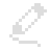
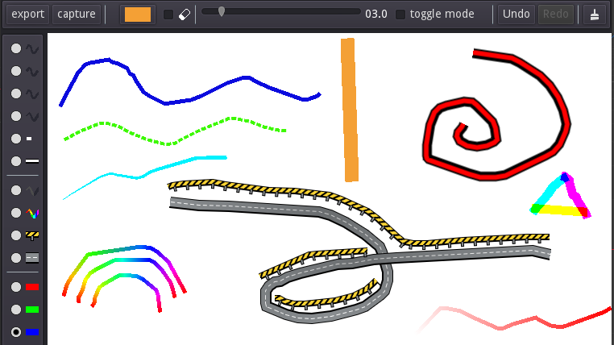

# Scratch Canvas 
Canvas for drawing in [Godot Engine](https://godotengine.org) with mouse, trackpad, touch and pen. Also inludes a demo of its features in the form of [scratch_drawer](scratch_drawer). See [canvas README](canvas) for more specifics.

 
 

## Aim
Have an adjustable canvas scene that you can just instance and use.

